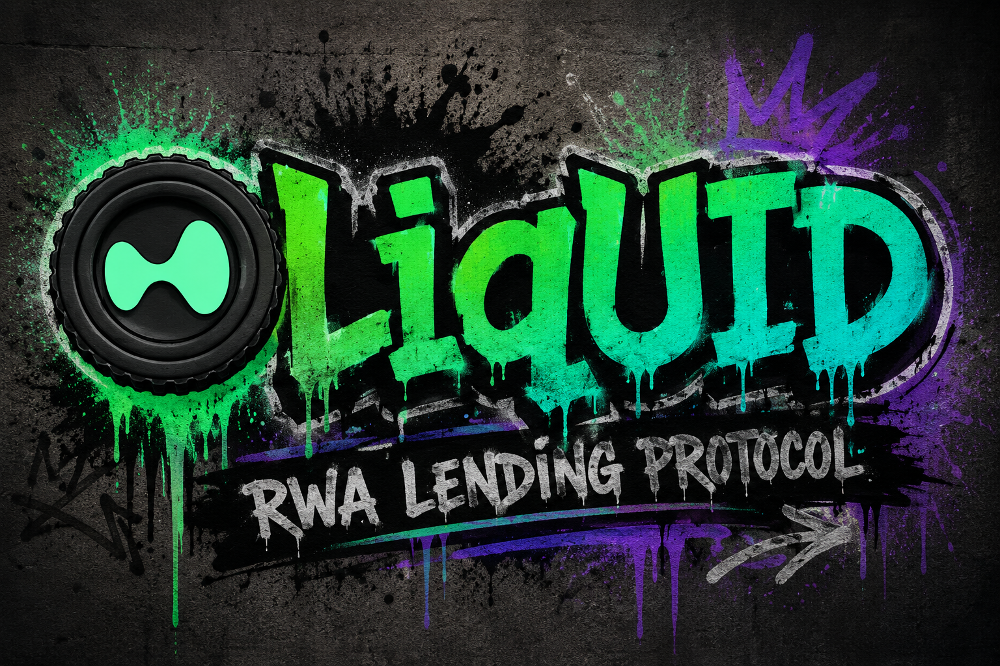
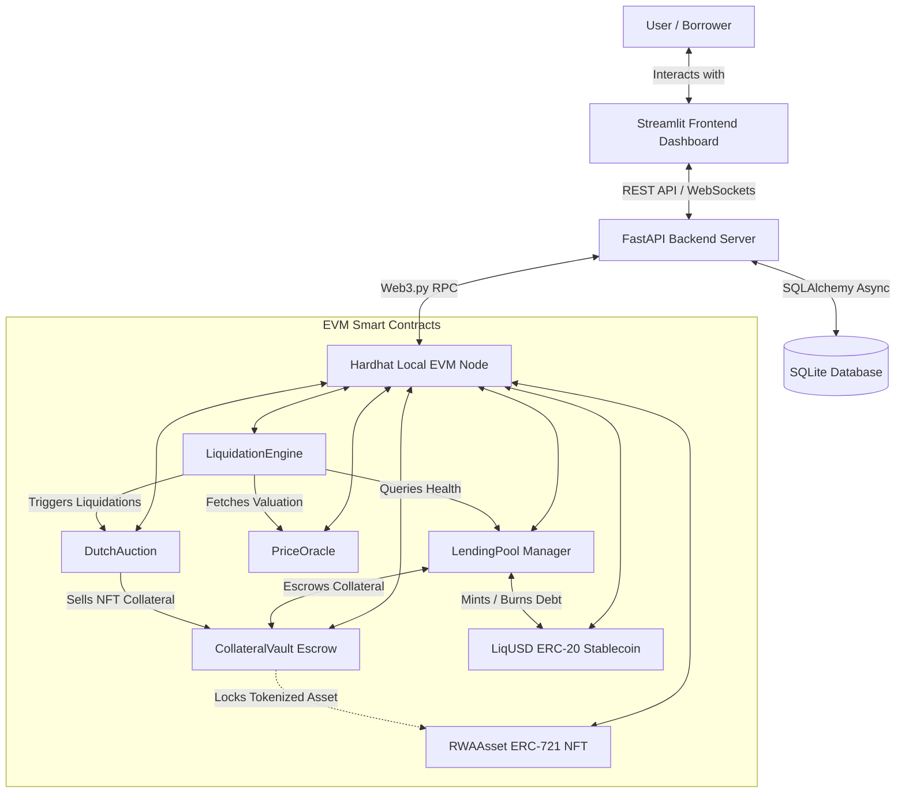

# liqUID.com

<div align="justify">
Welcome to <b>liqUID.com</b>, the <b>LCL Protocol (Liquid Centric Lending Protocol)</b>. This decentralized, non-custodial framework is designed to solve a very practical problem: you cannot pay for coffee with a physical deed to your farm. By bringing real-world assets onto the blockchain, we convert static physical properties into fluid, borrowable capital. The live platform is hosted at <a href="https://[live-demo-url-placeholder].com">https://[live-demo-url-placeholder].com</a>.
</div>
<br>



<br>

<div align="justify">
Historically, physical assets like real estate, rare art, or vintage luxury goods have been notoriously illiquid. If you need cash, you usually have to sell them (which takes months) or negotiate a bank loan (which takes even longer). liqUID.com changes that. We let you tokenize physical assets into ERC-721 NFTs, lock them into our secure Collateral Vault, and mint our algorithmic stablecoin, LiqUSD, against their value. If your collateral value drops below the safety threshold, the protocol automatically triggers a Dutch Auction to liquidate the asset. High-stakes finance, automated safety rails, zero bank visits.
</div>

---

## The Tech Stack

<div align="justify">
We selected this stack specifically to optimize developer sanity and protocol performance.
</div>

### The Python Core (Backend and UI)
* **FastAPI:** Our high-speed API engine. Runs asynchronously because life is too short to wait for synchronous thread pools.
* **SQLAlchemy and aiosqlite:** For managing state, pre-seeded assets, and history without needing to spin up a heavy database.
* **Streamlit:** Our interactive UI framework. Used because we love writing Python and wanted to avoid writing CSS at all costs.
* **Web3.py:** The bridge allowing our FastAPI backend to sign transactions and query contract states on our local blockchain.

### The Ethereum Layer (Smart Contracts)
* **Solidity:** For writing secure, deterministic money legos.
* **Hardhat:** Our compiler, local node orchestrator, and testing suite.
* **OpenZeppelin Contracts:** Because writing custom ERC-20 or ERC-721 code from scratch is the fastest way to get hacked.

---

## System Architecture

<div align="justify">
Here is how the components interact under the hood:
</div>



### Protocol Lifecycle Workflow
1. **Tokenize:** Mint an `RWAAsset` (ERC-721) representing your physical asset (e.g. $100,000 office space).
2. **Deposit & Borrow:** Deposit the NFT into the `CollateralVault` and borrow up to 75% of its value (Max LTV) in `LiqUSD` through the `LendingPool`.
3. **Monitor Health:** The `LiquidationEngine` checks your Loan-to-Value (LTV) ratio using `PriceOracle` valuation feeds. If your asset value plunges and the health factor drops below 1.0 (LTV > 85%), you are in trouble.
4. **Liquidate:** Anyone can trigger a liquidation. The `LiquidationEngine` fires up a `DutchAuction` where the starting price decays over time. The winning bid pays off your debt in `LiqUSD` and takes ownership of your tokenized asset.

---

## Quickstart Setup

### Prerequisites
<div align="justify">
Make sure you have the following installed on your machine:
</div>

* Python 3.10 or higher
* Node.js v18+ and npm
* Git

---

### Step 1: Initialize the Local Blockchain Node
<div align="justify">
Before starting the backend or frontend, we need an EVM network to deploy our contracts to.
</div>

```bash
# Navigate to the contracts directory
cd contracts

# Install dependencies
npm install

# Start a local Hardhat node
npx hardhat node
```
<div align="justify">
This spins up a local Ethereum testnet at http://127.0.0.1:8545 with 20 pre-funded accounts.
</div>

---

### Step 2: Deploy the Smart Contracts
<div align="justify">
Open a new terminal window and deploy the smart contracts to your local testnet:
</div>

```bash
cd contracts
npm run deploy
```
<div align="justify">
Take note of the deployed contract addresses printed to the console. If you update the addresses, make sure to sync them with your backend environment variables!
</div>

---

### Step 3: Run the Application Services
<div align="justify">
Our custom python utility launch.py handles seeding the database with dummy assets, spinning up the FastAPI backend, and running the Streamlit dashboard simultaneously.
</div>

```bash
# Return to the root project directory
cd ..

# Create and activate a python virtual environment
python -m venv venv
source venv/bin/activate  # On Windows use: venv\Scripts\activate

# Install backend and frontend dependencies
pip install -r requirements.txt

# Run the launch utility
python launch.py
```

<div align="justify">
Once loaded, you can access:
</div>

* Lending Dashboard: `http://localhost:8501`
* API Documentation: `http://localhost:8000/docs`

---

## Docker Deployment
<div align="justify">
If you prefer containerized setups and do not want to configure Python or Node environments locally:
</div>

```bash
# Build and run all backend and frontend services
docker-compose up --build
```
<div align="justify">
This runs the backend on port 8000 and frontend on port 8501. Note: For a complete Docker sandbox integration with the blockchain layer, you will need to point BLOCKCHAIN_RPC_URL to an active hardhat node.
</div>

---

## Testing the Protocol

<div align="justify">
We take security seriously (liquidation auctions are cold, unfeeling machines). You can run tests on both the smart contracts and Python services.
</div>

### Smart Contract Tests
<div align="justify">
Run Hardhat assertions inside the contracts directory:
</div>

```bash
cd contracts
npm test
```

### Backend & Lending Engine Tests
<div align="justify">
Run pytest assertions in the root directory:
</div>

```bash
pytest
```
